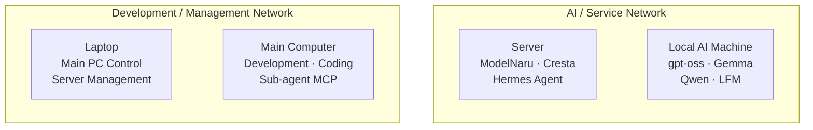

# 김재영 Portfolio

## Documents

- [이력서](./김재영_이력서.pdf)
- [포트폴리오](./김재영_포트폴리오.pdf)

## Personal Service

### ModelNaru

- 서비스: [chat.mihoservice.xyz](https://chat.mihoservice.xyz)
- 게스트 체험 코드: `testuser`

## Repositories

- [Cresta](https://github.com/totjae/Cresta)  
  AI 분석과 규칙 기반 리스크 엔진을 결합한 국내 주식 단기매매 시스템.

- [ModelNaru](https://github.com/totjae/modelnaru)  
  여러 AI Provider와 모델을 한곳에서 사용할 수 있도록 만든 셀프호스팅 AI 채팅 웹 서비스.

- [Breakwall](https://github.com/totjae/breakwall)  
  Godot 기반으로 제작한 랜덤 맵 벽돌부수기 게임.

- [DMI Market Pipeline](https://github.com/totjae/dmi-market-pipeline)  
  예약 실행되는 시장 분석 파이프라인의 상태와 결과를 관리하기 위한 저장소.

## Infrastructure

개인 서비스 운영, 로컬 AI 추론, 개발 및 시스템 관리를 역할별로 분리한 개인 인프라를 운영하고 있습니다.

### AI / Service Network

- **Server** — ModelNaru, Cresta, Hermes 등 개인 서비스와 에이전트 시스템 운영
- **Local AI Machine** — `gpt-oss`, `Gemma`, `Qwen`, `LFM` 계열 로컬 모델 구동

### Development / Management Network

- **Laptop** — 메인 컴퓨터 원격 제어 및 서버 관리
- **Main Computer** — 개발·코딩 작업 및 서브에이전트 MCP 실행
